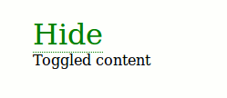

# Toggler

[![Build Status][travis-image]][travis-url]
[![Dependency Status][depstat-image]][depstat-url]
[![DevDependency Status][depstat-dev-image]][depstat-dev-url]

> Toggler for any content. RequireJS module

## Usage

```html
<div class="b-toggler _name_test b-toggler__toggler">
    <span class="b-toggler__text _name_opened">Hide</span>
    <span class="b-toggler__text _name_closed">Show</span>
</div>

<div class="b-toggler _name_test b-toggler__panel">
    Toggled content
</div>
```

```javascript
var toggler = new Toggler({
    name: 'test',
});
```



## Development

### Initialize
```sh
npm i
```

### Test
*In console*
```sh
npm run test
```

*In browser*
```sh
open ./text/index-test.html
```

### Lint
```sh
npm run lint
```

## License
MIT © [Vladimir Rodkin](https://github.com/VovanR)

[travis-url]: https://travis-ci.org/VovanR/b-toggler
[travis-image]: http://img.shields.io/travis/VovanR/b-toggler.svg

[depstat-url]: https://david-dm.org/VovanR/b-toggler
[depstat-image]: https://david-dm.org/VovanR/b-toggler.svg

[depstat-dev-url]: https://david-dm.org/VovanR/b-toggler
[depstat-dev-image]: https://david-dm.org/VovanR/b-toggler/dev-status.svg
